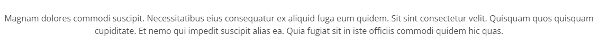
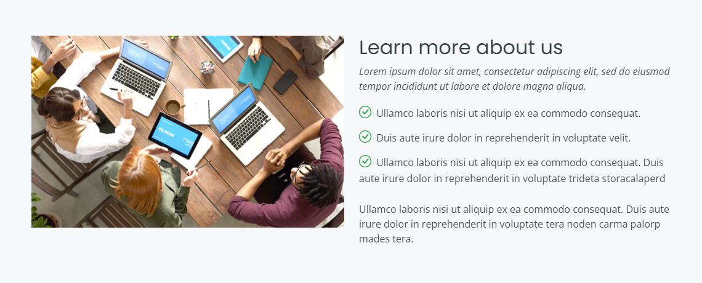
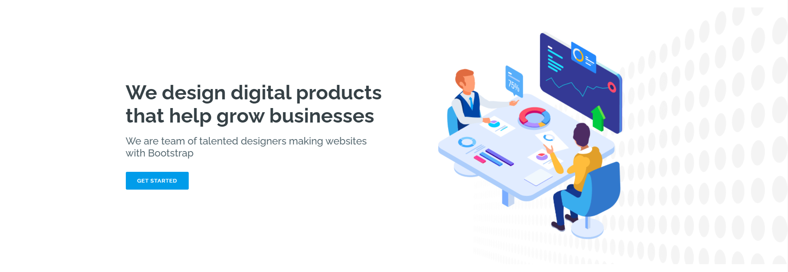
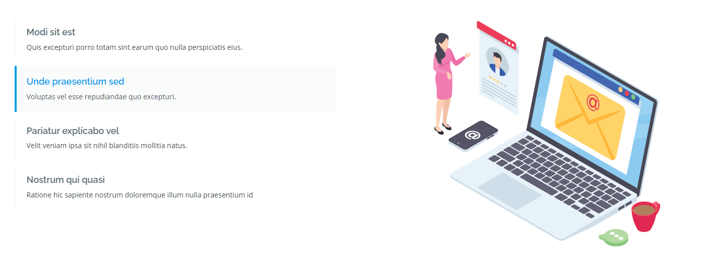
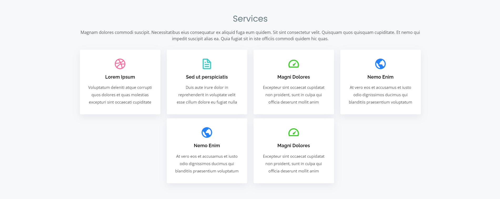
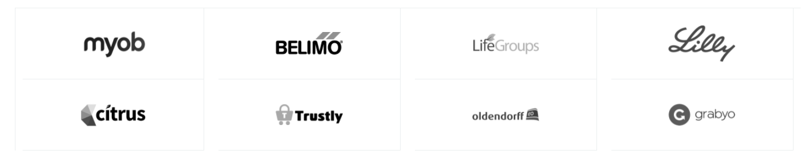
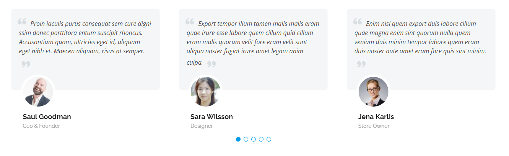
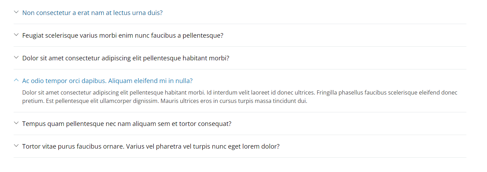
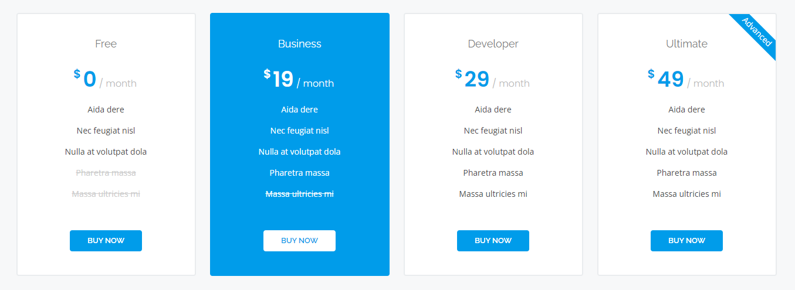
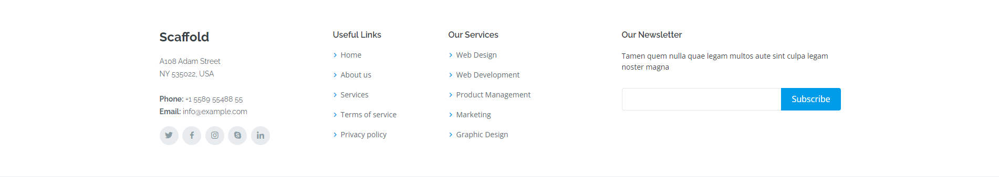

# Histórias para Treinamento AEM

O HTML, CSS e JS se encontam no arquivo [template.zip](template.zip).

**É importante lembrar que além dos componentes abaixo, a criação de um novo archetype, templates e policies também são necessários conforme for levantada a necessidade.**

## 1. Title 

O componente deve possibilitar o preenchimento do título e selecionar o nível do cabeçalho H1 - H6.

## 2. Text

O componente deve possibilitar a edição livre do texto com um richtext. 
As opções de negrito, itálico, sublinhado, hyperlink e listas devem estar **habilitadas**.

Imagens, vídeos e tabelas devem ser **desabilitadas**.

## 3. Image + Richtext

O componente deve possibilitar a edição livre do texto a esquerda com um richtext. 
Para a imagem a direita, deve ser possivel selecionar uma imagem para desktop e uma imagem para mobile. 

Além do *alt text* e *title text* da imagem também serem authoraveis. Caso estas informações estejam vazias na dialog, devem ser buscadas do **DAM**.

As opções de negrito, itálico, sublinhado, hyperlink e listas devem estar **habilitadas**.

Imagens, vídeos e tabelas devem ser **desabilitadas**.

## 4. Jumbotron

O componente deve possibilitar a authoração de:

- Titulo **obrigatório** e no **máximo** 50 caracteres;
- Subtitulo **opcional** e no **máximo** 50 caracteres;
- Checkbox para selecionar se o botão deve ou não ser exibido;
- Texto e Link para o botão **opcionais**;
- Imagem de backgroung - Desktop e Mobile - Ambas **opcionais**;
- Imagem a direita - Desktop **obrigatória** e Mobile **opcional**.

## 5. Slideshow

O componente deve exibir multiplos items representando um slideshow. A imagem a direita devera mudar conforme o item a esquerda for selecionado.

O author devera preencher no **mínimo** dois e no **máximo** 4 items. Cada item terá um título **obrigatório**, descrição **opcional** e uma imagem **obrigatória**. 

## 6. CTA (Call To Action)

Para o componente CTA, o título deve ser **obrigatório**, a descrição e a imagem de fundo devem ser **opcionais**.
O texto e link do botão devem ser **obrigatórios**.

## 7. Card List

O componente abrigará um número ilimitado de items. 
Cada item tem como atributos:
- Ícone **obrigatório**
- Título **obrigatório**
- Descrição **opcional**
- Color Picker - Default #FFFF

## 8. Image List

O componente será utilizado para listar imagens, deve permitir que até 8 imagens sejam selecionadas. 

## 9. Testimonials - Carousel

Este componente será um carrossel de testemunhos sobre a empresa ou produto. Ele aceitará um número ilimitado de testemunhos e cada um possui:
- Texto do testemunho - **Máximo** 200 caractéres;
- Nome da pessoa;
- Profissão;
- Foto de perfil.

## 10. Team - Container

Este componente será um carrossel de testemunhos sobre a empresa ou produto. Ele aceitará um número ilimitado de testemunhos e cada um possui:
- Nome da pessoa - **obrigatório**;
- Profissão - **obrigatório**;
- Foto de perfil - **obrigatório**;
- Links **opcionais** para redes sociais.

## 11. FAQ

O container de FAQ aceitará um número indeterminado de perguntas e respostas. Cada pergunta deve ter um título e uma resposta **obrigatóriamente**. As perguntas não podem passar de 100 caracteres e as respostas não tem um limite determinado.

## 12. Pricing

O container de preços aceitará um número indeterminado de cards. Cada card contém:

- Título - **obrigatório**;
- Valor - **obrigatório**;
- Recorrência - Day, Month, Year;
- Lista de benefícios - No **máximo** 5 itens e cada item pode ter o status de habilitado ou desabilitado(riscado);
- Texto do Botão - **obrigatório**;
- Link do Botão - **obrigatório**;
- Background branco ou azul;
- Texto para flag no canto superior direito.

## 13. Header

Para o componente Header, a imagem de logo deve ser authorável, assim como alt e title text.
Também aceitará até 8 textos+links para o menu e os ícones de social media devem ser escondidos ou exibidos baseado no preenchimento de seus links.

## 14. Footer

O footer é separado em 3 partes.

### Informações de contato

- Logo da empresa autorável;
- Endereço obrigatório;
- Telefone e email opcionais;
- Links de social media - Imagem(ícone) e Link - Máximo 5 items.

### Lista de Links

- Pode ter nenhuma, uma ou duas colunas de links;
- Cada link deve ter um texto e uma URL;
- Cada coluna pode ter até 5 links.

### Newsletter

- Título, descrição e texto do botão devem ser autoráveis e obrigatórios;
- O email preenchido pelo usuário final deve ser enviado para um endpoint(Java Servlet).
- O Servlet deve apenas validar o email e retonar para o frontend o resultado da validação;
- Neste momento não necessário armazenar o email em nenhum lugar.

